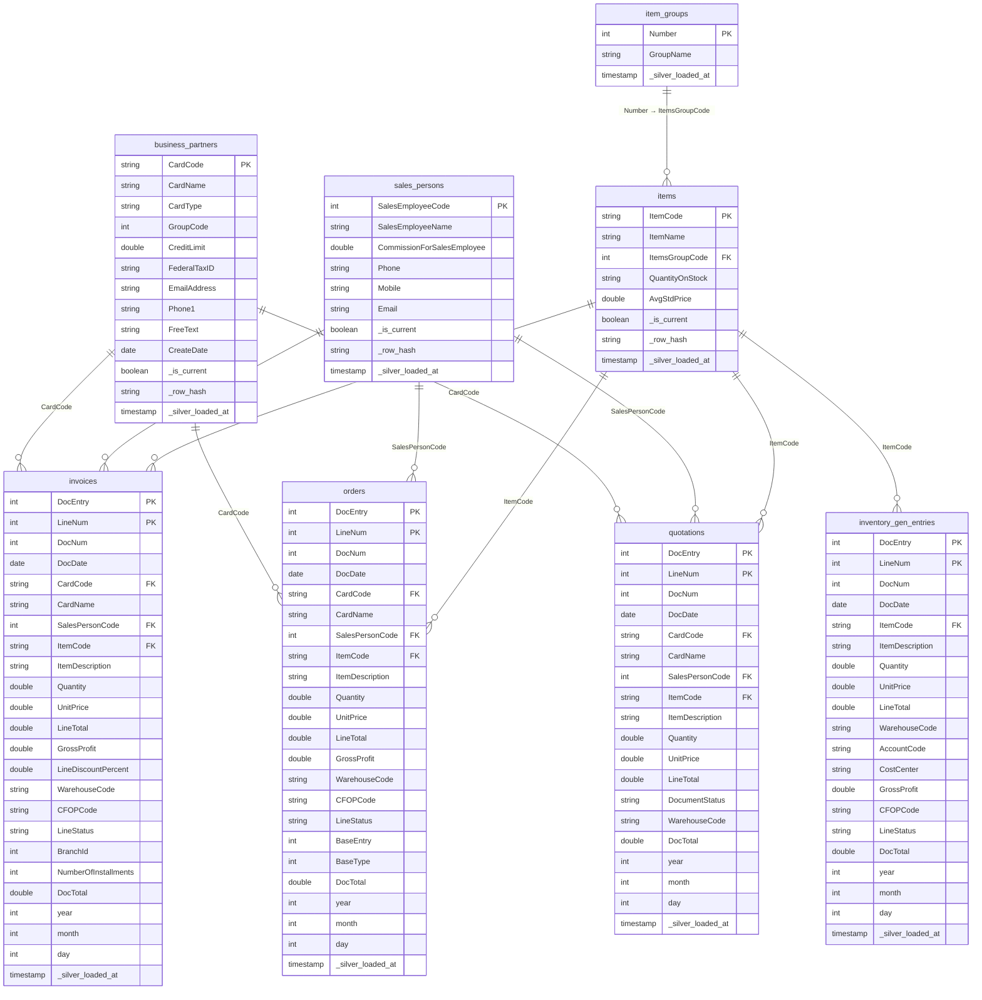
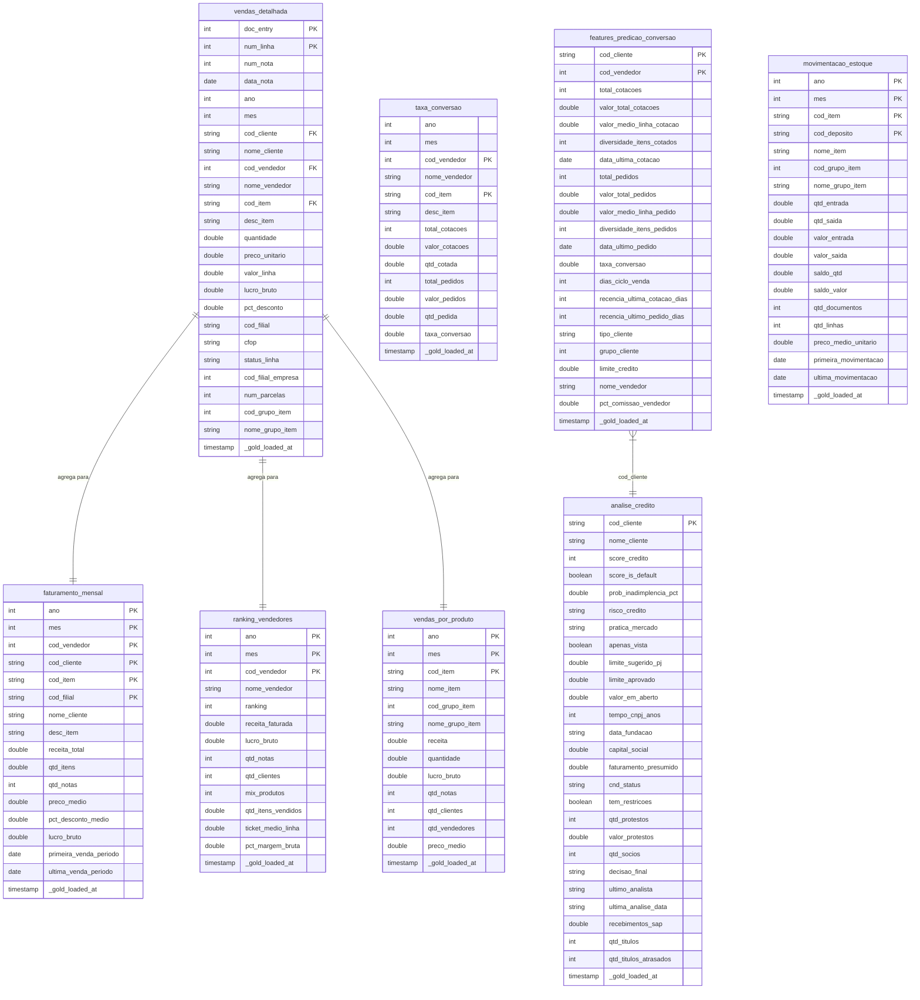
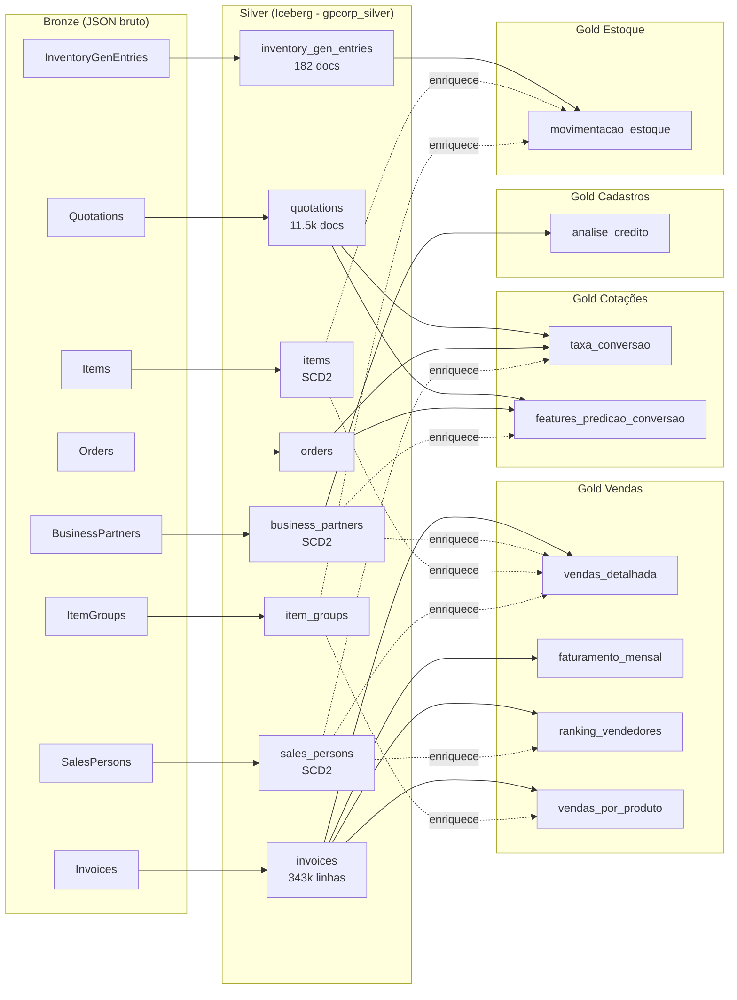

# Modelo Relacional — GP Corp Datalake

## Camada Silver (fonte SAP B1)

```mermaid
erDiagram
    business_partners {
        string CardCode PK
        string CardName
        string CardType
        int GroupCode
        double CreditLimit
        string FederalTaxID
        string EmailAddress
        string Phone1
        string FreeText
        date CreateDate
        boolean _is_current
        string _row_hash
        timestamp _silver_loaded_at
    }

    items {
        string ItemCode PK
        string ItemName
        int ItemsGroupCode FK
        string QuantityOnStock
        double AvgStdPrice
        boolean _is_current
        string _row_hash
        timestamp _silver_loaded_at
    }

    item_groups {
        int Number PK
        string GroupName
        timestamp _silver_loaded_at
    }

    sales_persons {
        int SalesEmployeeCode PK
        string SalesEmployeeName
        double CommissionForSalesEmployee
        string Phone
        string Mobile
        string Email
        boolean _is_current
        string _row_hash
        timestamp _silver_loaded_at
    }

    invoices {
        int DocEntry PK
        int LineNum PK
        int DocNum
        date DocDate
        string CardCode FK
        string CardName
        int SalesPersonCode FK
        string ItemCode FK
        string ItemDescription
        double Quantity
        double UnitPrice
        double LineTotal
        double GrossProfit
        double LineDiscountPercent
        string WarehouseCode
        string CFOPCode
        string LineStatus
        int BranchId
        int NumberOfInstallments
        double DocTotal
        int year
        int month
        int day
        timestamp _silver_loaded_at
    }

    orders {
        int DocEntry PK
        int LineNum PK
        int DocNum
        date DocDate
        string CardCode FK
        string CardName
        int SalesPersonCode FK
        string ItemCode FK
        string ItemDescription
        double Quantity
        double UnitPrice
        double LineTotal
        double GrossProfit
        string WarehouseCode
        string CFOPCode
        string LineStatus
        int BaseEntry
        int BaseType
        double DocTotal
        int year
        int month
        int day
        timestamp _silver_loaded_at
    }

    quotations {
        int DocEntry PK
        int LineNum PK
        int DocNum
        date DocDate
        string CardCode FK
        string CardName
        int SalesPersonCode FK
        string ItemCode FK
        string ItemDescription
        double Quantity
        double UnitPrice
        double LineTotal
        string DocumentStatus
        string WarehouseCode
        double DocTotal
        int year
        int month
        int day
        timestamp _silver_loaded_at
    }

    inventory_gen_entries {
        int DocEntry PK
        int LineNum PK
        int DocNum
        date DocDate
        string ItemCode FK
        string ItemDescription
        double Quantity
        double UnitPrice
        double LineTotal
        string WarehouseCode
        string AccountCode
        string CostCenter
        double GrossProfit
        string CFOPCode
        string LineStatus
        double DocTotal
        int year
        int month
        int day
        timestamp _silver_loaded_at
    }

    %% Relacionamentos
    business_partners ||--o{ invoices : "CardCode"
    business_partners ||--o{ orders : "CardCode"
    business_partners ||--o{ quotations : "CardCode"
    sales_persons ||--o{ invoices : "SalesPersonCode"
    sales_persons ||--o{ orders : "SalesPersonCode"
    sales_persons ||--o{ quotations : "SalesPersonCode"
    items ||--o{ invoices : "ItemCode"
    items ||--o{ orders : "ItemCode"
    items ||--o{ quotations : "ItemCode"
    items ||--o{ inventory_gen_entries : "ItemCode"
    item_groups ||--o{ items : "Number → ItemsGroupCode"
```

## Camada Gold (domínios de negócio)

```mermaid
erDiagram
    %% ═══ DOMÍNIO: VENDAS (gpcorp_gold_vendas) ═══

    vendas_detalhada {
        int doc_entry PK
        int num_linha PK
        int num_nota
        date data_nota
        int ano
        int mes
        string cod_cliente FK
        string nome_cliente
        int cod_vendedor FK
        string nome_vendedor
        string cod_item FK
        string desc_item
        double quantidade
        double preco_unitario
        double valor_linha
        double lucro_bruto
        double pct_desconto
        string cod_filial
        string cfop
        string status_linha
        int cod_filial_empresa
        int num_parcelas
        int cod_grupo_item
        string nome_grupo_item
        timestamp _gold_loaded_at
    }

    faturamento_mensal {
        int ano PK
        int mes PK
        int cod_vendedor PK
        string cod_cliente PK
        string cod_item PK
        string cod_filial PK
        string nome_cliente
        string desc_item
        double receita_total
        double qtd_itens
        int qtd_notas
        double preco_medio
        double pct_desconto_medio
        double lucro_bruto
        date primeira_venda_periodo
        date ultima_venda_periodo
        timestamp _gold_loaded_at
    }

    ranking_vendedores {
        int ano PK
        int mes PK
        int cod_vendedor PK
        string nome_vendedor
        int ranking
        double receita_faturada
        double lucro_bruto
        int qtd_notas
        int qtd_clientes
        int mix_produtos
        double qtd_itens_vendidos
        double ticket_medio_linha
        double pct_margem_bruta
        timestamp _gold_loaded_at
    }

    vendas_por_produto {
        int ano PK
        int mes PK
        string cod_item PK
        string nome_item
        int cod_grupo_item
        string nome_grupo_item
        double receita
        double quantidade
        double lucro_bruto
        int qtd_notas
        int qtd_clientes
        int qtd_vendedores
        double preco_medio
        timestamp _gold_loaded_at
    }

    %% ═══ DOMÍNIO: COTAÇÕES (gpcorp_gold_cotacoes) ═══

    taxa_conversao {
        int ano
        int mes
        int cod_vendedor PK
        string nome_vendedor
        string cod_item PK
        string desc_item
        int total_cotacoes
        double valor_cotacoes
        double qtd_cotada
        int total_pedidos
        double valor_pedidos
        double qtd_pedida
        double taxa_conversao
        timestamp _gold_loaded_at
    }

    features_predicao_conversao {
        string cod_cliente PK
        int cod_vendedor PK
        int total_cotacoes
        double valor_total_cotacoes
        double valor_medio_linha_cotacao
        int diversidade_itens_cotados
        date data_ultima_cotacao
        int total_pedidos
        double valor_total_pedidos
        double valor_medio_linha_pedido
        int diversidade_itens_pedidos
        date data_ultimo_pedido
        double taxa_conversao
        int dias_ciclo_venda
        int recencia_ultima_cotacao_dias
        int recencia_ultimo_pedido_dias
        string tipo_cliente
        int grupo_cliente
        double limite_credito
        string nome_vendedor
        double pct_comissao_vendedor
        timestamp _gold_loaded_at
    }

    %% ═══ DOMÍNIO: CADASTROS (gpcorp_gold_cadastros) ═══

    analise_credito {
        string cod_cliente PK
        string nome_cliente
        int score_credito
        boolean score_is_default
        double prob_inadimplencia_pct
        string risco_credito
        string pratica_mercado
        boolean apenas_vista
        double limite_sugerido_pj
        double limite_aprovado
        double valor_em_aberto
        int tempo_cnpj_anos
        string data_fundacao
        double capital_social
        double faturamento_presumido
        string cnd_status
        boolean tem_restricoes
        int qtd_protestos
        double valor_protestos
        int qtd_socios
        string decisao_final
        string ultimo_analista
        string ultima_analise_data
        double recebimentos_sap
        int qtd_titulos
        int qtd_titulos_atrasados
        timestamp _gold_loaded_at
    }

    %% ═══ DOMÍNIO: ESTOQUE (gpcorp_gold_estoque) ═══

    movimentacao_estoque {
        int ano PK
        int mes PK
        string cod_item PK
        string cod_deposito PK
        string nome_item
        int cod_grupo_item
        string nome_grupo_item
        double qtd_entrada
        double qtd_saida
        double valor_entrada
        double valor_saida
        double saldo_qtd
        double saldo_valor
        int qtd_documentos
        int qtd_linhas
        double preco_medio_unitario
        date primeira_movimentacao
        date ultima_movimentacao
        timestamp _gold_loaded_at
    }

    %% Relacionamentos Gold (drill-down)
    vendas_detalhada ||--|| faturamento_mensal : "agrega para"
    vendas_detalhada ||--|| ranking_vendedores : "agrega para"
    vendas_detalhada ||--|| vendas_por_produto : "agrega para"
    features_predicao_conversao }|--|| analise_credito : "cod_cliente"
```

## Fluxo de Dados (Bronze → Silver → Gold)

```mermaid
flowchart LR
    subgraph Bronze["Bronze (JSON bruto)"]
        B1[BusinessPartners]
        B2[Items]
        B3[ItemGroups]
        B4[SalesPersons]
        B5[Invoices]
        B6[Orders]
        B7[Quotations]
        B8[InventoryGenEntries]
    end

    subgraph Silver["Silver (Iceberg - gpcorp_silver)"]
        S1[business_partners<br/>SCD2]
        S2[items<br/>SCD2]
        S3[item_groups]
        S4[sales_persons<br/>SCD2]
        S5[invoices<br/>343k linhas]
        S6[orders]
        S7[quotations<br/>11.5k docs]
        S8[inventory_gen_entries<br/>182 docs]
    end

    subgraph GoldVendas["Gold Vendas"]
        G1[vendas_detalhada]
        G2[faturamento_mensal]
        G3[ranking_vendedores]
        G4[vendas_por_produto]
    end

    subgraph GoldCotacoes["Gold Cotações"]
        G5[taxa_conversao]
        G6[features_predicao_conversao]
    end

    subgraph GoldCadastros["Gold Cadastros"]
        G7[analise_credito]
    end

    subgraph GoldEstoque["Gold Estoque"]
        G8[movimentacao_estoque]
    end

    B1 --> S1
    B2 --> S2
    B3 --> S3
    B4 --> S4
    B5 --> S5
    B6 --> S6
    B7 --> S7
    B8 --> S8

    S5 --> G1
    S5 --> G2
    S5 --> G3
    S5 --> G4
    S7 --> G5
    S6 --> G5
    S7 --> G6
    S6 --> G6
    S1 --> G7
    S8 --> G8

    S1 -.enriquece.-> G1
    S2 -.enriquece.-> G1
    S4 -.enriquece.-> G1
    S3 -.enriquece.-> G4
    S4 -.enriquece.-> G3
    S4 -.enriquece.-> G5
    S1 -.enriquece.-> G6
    S2 -.enriquece.-> G8
    S3 -.enriquece.-> G8
```
